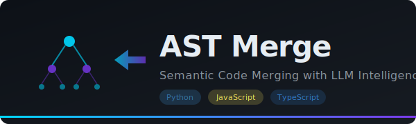

<p align="center">
  
</p>

<h1 align="center">AST Merge</h1>

<p align="center">
  <strong>Intelligent code merging powered by Abstract Syntax Trees + LLM</strong>
</p>

<p align="center">
  <a href="#features">Features</a> &bull;
  <a href="#how-it-works">How It Works</a> &bull;
  <a href="#quick-start">Quick Start</a> &bull;
  <a href="#api-reference">API</a> &bull;
  <a href="#architecture">Architecture</a> &bull;
  <a href="#contributing">Contributing</a>
</p>

<p align="center">
  
  
  
  
  
</p>

---

**Stop resolving merge conflicts line by line.** AST Merge understands your code's *structure* -- functions, classes, methods, imports -- and merges them semantically. For complex conflicts, it calls an LLM with only the relevant context, not your entire file.

Traditional merge tools treat code as text. AST Merge treats it as what it actually is: **a tree of meaningful structures.**

<p align="center">
  
</p>

## The Problem

Every developer has been here:

```
<<<<<<< HEAD
def calculate_total(items, tax_rate):
    subtotal = sum(item.price for item in items)
    return subtotal * (1 + tax_rate)
=======
def calculate_total(items, discount=0):
    subtotal = sum(item.price for item in items)
    return subtotal - discount
>>>>>>> feature-branch
```

Git sees conflicting lines. You see two features that should coexist. You manually merge them. Again. And again.

**AST Merge sees both versions structurally**, understands that one added `tax_rate` and the other added `discount`, and produces:

```python
def calculate_total(items, tax_rate, discount=0):
    subtotal = sum(item.price for item in items)
    return (subtotal * (1 + tax_rate)) - discount
```

## Features

- **Semantic Merging** -- Understands functions, classes, methods, and imports as discrete units, not just text lines
- **Multi-Language** -- Supports Python and JavaScript/TypeScript with dedicated parsers
- **3 Merge Strategies** -- From zero-cost local merging to full LLM-powered resolution
- **Context-Efficient LLM** -- Sends only changed nodes + their dependencies to the LLM, not entire files
- **Dependency Tracking** -- Knows which code depends on what, preserves import chains
- **Visual Diff & Merge UI** -- Monaco Editor-based interface showing structural diffs, context previews, and merge decisions
- **Transparent Decisions** -- Every merge decision is logged with reasoning: kept base, kept target, LLM-merged, or removed
- **Conflict Detection** -- Identifies true semantic conflicts vs. safe parallel changes

## How It Works

AST Merge follows a four-stage pipeline:

```
                    +-----------+
                    |  Base     |     +-----------+
                    |  Code     +---->|           |
                    +-----------+     |  1. PARSE |     +----------+     +-----------+
                                      |  (AST)    +---->| 2. DIFF  +---->| 3. CONTEXT|
                    +-----------+     |           |     | (Semantic)|    | (Minimal) |
                    |  Target   +---->|           |     +----------+     +-----+-----+
                    |  Code     |     +-----------+                           |
                    +-----------+                                             v
                                                                      +------+------+
                                                                      |  4. MERGE   |
                                                                      |  (Strategy) |
                                                                      +------+------+
                                                                             |
                                                                      +------v------+
                                                                      | Merged Code |
                                                                      +-------------+
```

### Stage 1: Parse

Code is parsed into an AST and decomposed into semantic nodes:

| Node Type | Examples |
|-----------|----------|
| `FUNCTION` | `def process()`, `function handle()` |
| `CLASS` | `class User:`, `class Router {}` |
| `METHOD` | `User.get_name()`, `Router.navigate()` |
| `IMPORT` | `import os`, `import { useState }` |
| `VARIABLE` | `MAX_RETRIES = 3`, `const API_URL = ...` |
| `ARROW_FUNCTION` | `const handler = () => {}` |

Each node captures: name, type, source code, signature, dependencies, parent/children relationships, and line range.

### Stage 2: Diff

Nodes are compared semantically (not textually) to produce four change types:

- **Added** -- exists in target but not base
- **Removed** -- exists in base but not target
- **Modified** -- exists in both with different implementation
- **Unchanged** -- identical in both versions

### Stage 3: Context Extraction

For each changed node, the system extracts the **minimal sufficient context**:

- Related nodes (up to 5 dependencies)
- Relevant imports only (not all imports)
- Parent class signature (for methods)

This means the LLM receives a focused, small payload instead of two full files.

### Stage 4: Merge

Three strategies available:

| Strategy | LLM Usage | Best For |
|----------|-----------|----------|
| `auto` | None | Simple merges, additions/deletions |
| `smart` | Only for modified nodes | Most real-world merges (cost-effective) |
| `llm_all` | All changes | Maximum consistency |

## Quick Start

### Prerequisites

- Python 3.11+
- Node.js 18+
- AWS credentials (only for `smart` and `llm_all` strategies)

### Backend

```bash
cd backend

# Install dependencies
pip install -e .
# or with uv
uv sync

# Start the API server
uvicorn main:app --host 0.0.0.0 --port 8000 --reload
```

### Frontend

```bash
cd frontend

# Install dependencies
npm install

# Start the dev server
npm run dev
```

Open [http://localhost:5173](http://localhost:5173) in your browser.

### Try It Out

1. Select a language (Python or JavaScript)
2. Load sample code or paste your own base/target versions
3. Click **Compare** to see the structural diff
4. Choose a merge strategy
5. Click **Merge** to get the intelligently merged result

## API Reference

All endpoints accept and return JSON.

### `GET /`

Returns API info and available endpoints.

### `POST /parse`

Parse code into its AST structure.

```json
{
  "code": "def hello(): pass",
  "language": "python"
}
```

### `POST /diff`

Compute semantic diff between two code versions.

```json
{
  "base_code": "def hello(): pass",
  "target_code": "def hello():\n    print('hi')",
  "language": "python"
}
```

### `POST /context`

Extract minimal LLM context for changed nodes.

```json
{
  "base_code": "...",
  "target_code": "...",
  "language": "python",
  "include_unchanged": false
}
```

### `POST /merge`

Merge two code versions with a chosen strategy.

```json
{
  "base_code": "...",
  "target_code": "...",
  "language": "python",
  "strategy": "smart",
  "aws_region": "us-east-1",
  "aws_access_key_id": "...",
  "aws_secret_access_key": "...",
  "bedrock_model_id": "anthropic.claude-3-haiku-20240307-v1:0"
}
```

## Architecture

```
AST_merge/
├── backend/
│   ├── main.py              # FastAPI app, endpoints, request models
│   ├── ast_parser.py         # Python AST parser (stdlib ast module)
│   ├── js_parser.py          # JavaScript/TypeScript parser (tree-sitter + regex fallback)
│   ├── ast_differ.py         # Semantic diff engine
│   ├── context_extractor.py  # Minimal context builder for LLM
│   ├── merge_engine.py       # Merge strategies + AWS Bedrock client
│   ├── models.py             # Shared data models (CodeNode, DiffResult, etc.)
│   └── pyproject.toml
│
├── frontend/
│   ├── src/
│   │   ├── App.tsx           # Main app: editors, controls, workflow
│   │   ├── components/
│   │   │   ├── CodeEditor.tsx    # Monaco Editor wrapper
│   │   │   ├── DiffView.tsx      # Structural diff visualization
│   │   │   ├── ContextView.tsx   # LLM context preview
│   │   │   └── MergePanel.tsx    # Merge results & decisions
│   │   ├── services/
│   │   │   └── api.ts        # Backend API client
│   │   └── App.css           # Dark theme styling
│   ├── package.json
│   └── vite.config.ts
│
└── README.md
```

### Key Design Decisions

- **AST over text** -- Traditional three-way merge treats code as lines. AST Merge understands code structure, which means additions and modifications are detected at the function/class level, not the line level.

- **Minimal context for LLM** -- Instead of sending two full files to the LLM (expensive and noisy), only changed nodes plus their immediate dependencies are sent. This reduces token usage by 80-95% on real codebases.

- **Conservative defaults** -- The `auto` strategy keeps disputed code rather than deleting it. Better to have a redundant function than a missing one.

- **Tree-sitter + fallback** -- JavaScript parsing uses tree-sitter for accuracy when available, with a regex-based fallback so the tool works without native dependencies.

## Tech Stack

| Layer | Technology |
|-------|-----------|
| Backend Framework | [FastAPI](https://fastapi.tiangolo.com/) |
| Python Parsing | `ast` (stdlib) |
| JS/TS Parsing | [tree-sitter](https://tree-sitter.github.io/) + regex fallback |
| LLM Provider | [AWS Bedrock](https://aws.amazon.com/bedrock/) (Claude) |
| Frontend Framework | [React 19](https://react.dev/) + TypeScript |
| Code Editor | [Monaco Editor](https://microsoft.github.io/monaco-editor/) |
| Build Tool | [Vite](https://vite.dev/) |
| HTTP Client | [Axios](https://axios-http.com/) |

## Use Cases

- **Feature branch merges** -- Two developers modified the same class differently. AST Merge combines both feature additions.
- **Refactoring + feature work** -- One branch refactored a function's signature while another added new logic. AST Merge handles both.
- **Long-lived branch rebase** -- A branch diverged significantly. AST Merge identifies what actually changed semantically vs. what's just reformatted.
- **Code review assistance** -- Use the diff endpoint to get a structural understanding of changes, not just line diffs.
- **Automated CI merging** -- Integrate the API into CI pipelines for automatic merge conflict resolution.

## Roadmap

- [ ] Support for more languages (Go, Rust, Java)
- [ ] Git integration -- resolve conflicts directly from `git mergetool`
- [ ] Three-way merge (base + ours + theirs)
- [ ] VS Code extension
- [ ] Support for additional LLM providers (OpenAI, local models)
- [ ] Batch merge for multiple files
- [ ] Merge confidence scoring

## Contributing

Contributions are welcome! Here's how to get started:

1. Fork the repository
2. Create a feature branch (`git checkout -b feature/amazing-feature`)
3. Make your changes
4. Run tests (`cd backend && pytest`)
5. Commit your changes (`git commit -m 'Add amazing feature'`)
6. Push to the branch (`git push origin feature/amazing-feature`)
7. Open a Pull Request

## License

This project is licensed under the MIT License -- see the [LICENSE](LICENSE) file for details.

---

<p align="center">
  <strong>If AST Merge saved you from a merge conflict, consider giving it a star!</strong>
</p>
